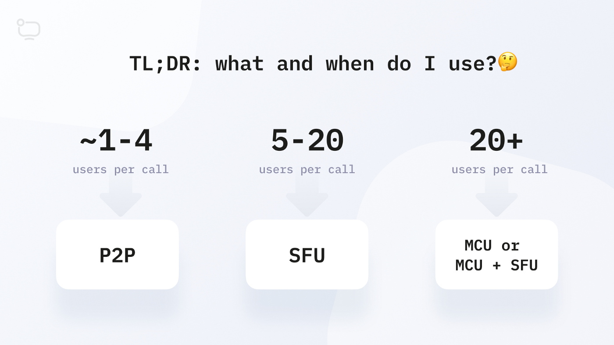
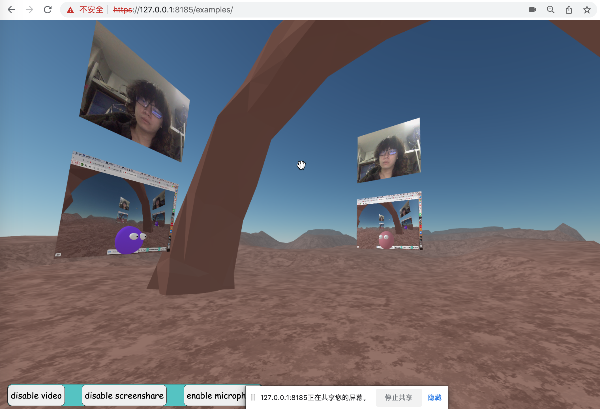

### NAF-Mediasoup-Adapter

#### Why SFU?

P2P architecture of WebRTC is good and easy to implement and scale, and has no pressure on the server side because the stream is transported and received directly to/from the other side, where the server only takes care of `small packet exchange`(candidate/sdp/room info, etc.) but has no awareness of the video/audio stream. However, the pressure goes to the client side. For each new peer coming in, a single client will have to encode/decode/... two more individual streams, which decides the scalability and efficiency of P2P is poor especially when there are more than 5 people in the room video chatting.



SFU architecture will mitigate such problems and has better scalability and capacity of media streaming, while it allows the server to do something about the video/audio streaming. Thus, the client will suffer less and enjoy more people concurrently joining the room and chatting via video and voice, with better quality and lower delay.

#### Intro

All the excellent features already provided by [NAF](https://github.com/networked-aframe/networked-aframe) remain the same. The only thing that this mediasoup-adapter does is to allow more clients to have voice/video chat with each other with higher quality and lower delay. You will find it useful especially when there are 8/9 or more players in a single room.

#### Install

```shell
git clone https://github.com/Vesper0704/naf-mediasoup-adapter.git

cd /path/to/naf-mediasoup-adapter

### install the dependencies of NAF
npm install

### make your own ssl certificate and key and place them under ssl directory
openssl genrsa -out server.key 1024
openssl req -new -key server.key -out server.csr
openssl x509 -req -in server.csr -signkey server.key -out server.crt

### run the server
npm start

### open the browser to test (open multiple tabs to see each other)
https://127.0.0.1:8185/examples
```

#### Example

```html
<!-- <script src="https://aframe.io/releases/1.3.0/aframe.min.js"></script> -->
<script src="../dist/aframe.min.js"></script>

<!-- <script src="https://cdn.socket.io/4.5.3/socket.io.min.js"
  integrity="sha384-WPFUvHkB1aHA5TDSZi6xtDgkF0wXJcIIxXhC6h8OT8EH3fC5PWro5pWJ1THjcfEi"
  crossorigin="anonymous"></script> -->
<script src="../dist/socketio_client_4.5.3.min.js"></script>

<!-- <script src="https://unpkg.com/networked-aframe@^0.10.0/dist/networked-aframe.min.js"
  crossorigin="anonymous"></script> -->
<script src="../dist/networked-aframe.min.js"></script>

<script src="../dist/mediasoup-adapter.js"></script>
<!-- mediasoup-client necessary -->
<script src="../dist/mediasoupclient.min.js"></script>

<a-scene networked-scene="
      room: default;
      debug: true;
      adapter: mediasoup;
      video: true;
      audio: false;
"></a-scene>

<script>
document.addEventListener('DOMContentLoaded', () => {
  document.querySelector('a-scene').addEventListener('adapter-ready', ({ detail: adapter }) => {
      // disable/enable simulcast
      adapter.simulcastMode = false

      // set heartbeat interval to 30 secs
      adapter.setHeartbeatTimer(30)
    })
  })
  
 // you can toggle video/audio streams like this
NAF.connection.adapter.resumeStream('video')
NAF.connection.adapter.pauseStream('video')
  
// support video(webcam), audio(microphone) and screenshare(screen sharing)
 function toggleStream(target, type) {

    let stream = type === 'video' ? webcamStream : type === 'audio' ? microphoneStream : screenshareStream
    if (target.textContent.includes('enable')) {
      try {
        // enable/resume stream
        if (!stream) {
          // first time
          switch (type) {
            case 'video':
              navigator.mediaDevices.getUserMedia({ video: true, audio: false })
                .then(async (_stream) => {
                webcamStream = _stream
                await NAF.connection.adapter.addLocalMediaStream(_stream, type)
              })
                .catch(e => {
                console.log(e);
              })
              break;
            case 'audio':
              navigator.mediaDevices.getUserMedia({ video: false, audio: true })
                .then(async (_stream) => {
                microphoneStream = _stream
                await NAF.connection.adapter.addLocalMediaStream(_stream, type)
              })
                .catch(e => {
                console.log(e);
              })
              break;
            case 'screenshare':
              navigator.mediaDevices.getDisplayMedia()
                .then(async (_stream) => {
                screenshareStream = _stream
                await NAF.connection.adapter.addLocalMediaStream(_stream, type)
              })
                .catch(e => {
                console.log(e);
              })
              break;
            default:
              console.log(`unknown mediastream type: ${type}`)
              break;
          }
        } else {
          const { e, msg, length } = NAF.connection.adapter.resumeStream(type)
          if (e) return
          if (!length) return console.log(`no ${type} producers now`);
        }
      } catch (e) {
        console.log(`error occured when enabing stream...`, e);
      }
      target.textContent = `disable ${type}`


    } else {
      // disable/pause stream
      if (!stream) return console.log(`no ${type} stream yet`)

      const { e, msg, length } = NAF.connection.adapter.pauseStream(type)
      if (e) return
      if (!length) return console.log(`no ${type} producers now`);
      target.textContent = `enable ${type}`
    }
  }

</script>
```

#### Demo

- Enable screen sharing and webcam at the same time.



#### Mediasoup

Any questions and details on the mediasoup refer to [mediasoup documentation](https://mediasoup.org/documentation/v3/).

Installation can be found in https://mediasoup.org/documentation/v3/mediasoup/installation/

#### Make it better

I'm just a startup learner and there are a lot more to be fixed and done in the future. If you are interested, you can check out the source code and help me to point out any flaws. I'll appreciate it!!!

#### Issues For Now

- ...